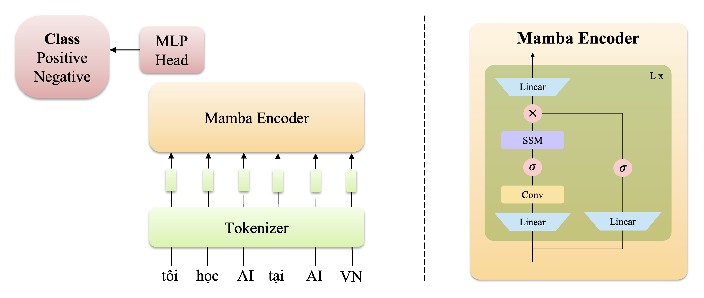
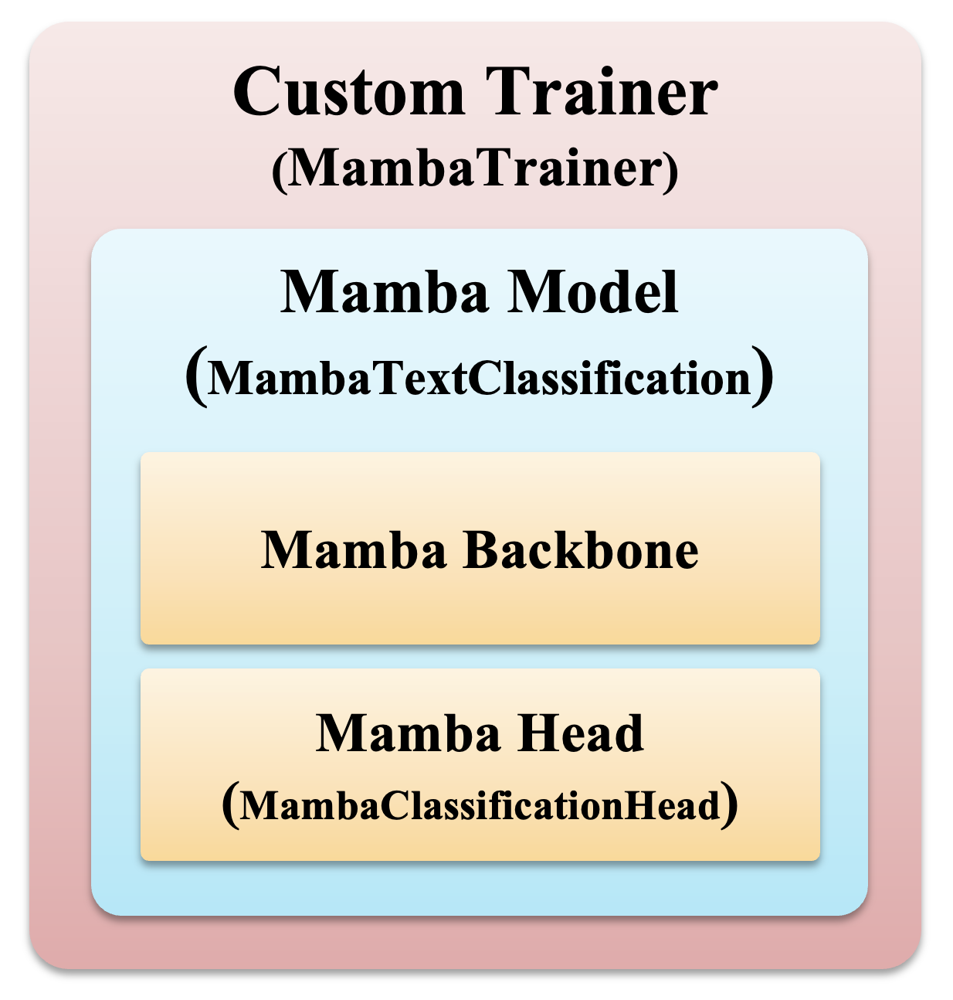
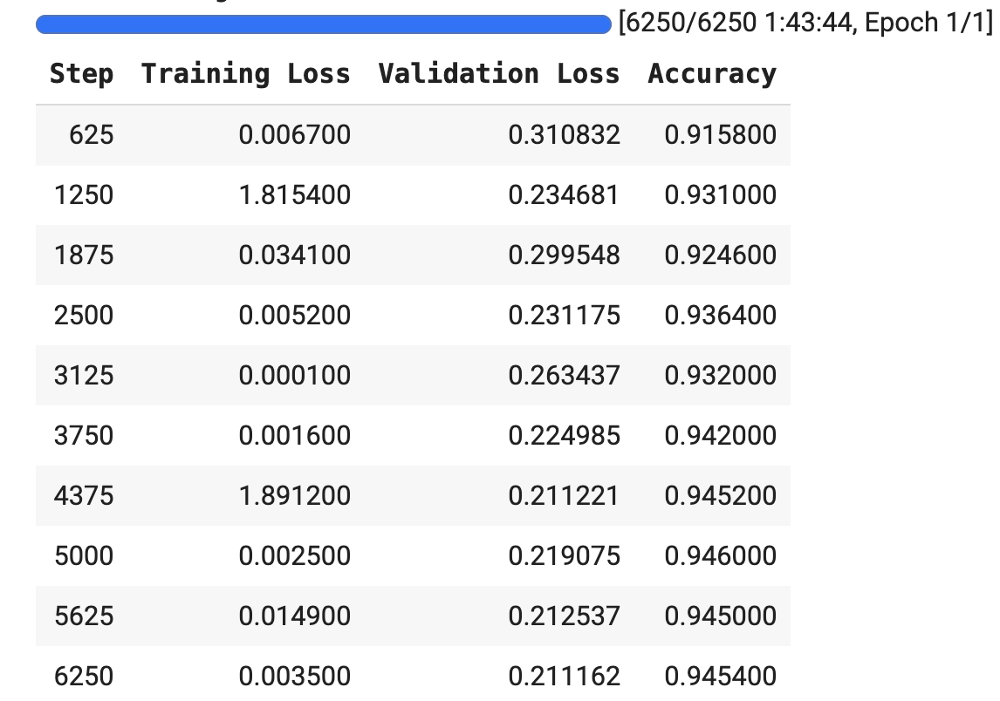

<!--  -->

## Phần I: Giới thiệu

Gần đây, [Mamba](https://arxiv.org/abs/2312.00752) là kiến trúc mới ra mắt và được sự hưởng ứng mạnh mẽ từ cộng đồng các nhà nghiên cứu. Mamba trở thành trend vì khả năng vượt trội hơn Transformer (kiến trúc phổ biến ở thời điểm hiện tại). Sự vượt trội được thể hiện ở cả 3 tiêu chí chính để đánh giá 1 model: accuracy, speed, và computional cost.



Trong project này, ta sẽ tìm hiểu cơ bản về kiến trúc Mamba và áp dụng Mamba vào bài toán text classification.


## Phần II: Nội dung

### Mô tả dataset IMDB

IMDB dataset là bộ data bao gồm 50,000 đánh giá về phim. Đây là bộ dữ liệu được sử dụng cho việc phân loại đánh giá tiêu cực và tích cực. Bộ dữ liệu được chia làm 2 phần bằng nhau, 25,000 mẫu để train, và 25,000 mẫu để kiểm thử. Bên cạnh đó, bộ dữ liệu cũng cung cấp 50,000 mẫu dữ liệu chưa đánh nhãn để hỗ trợ quá trình train. Tuy nhiên trong project này ta chỉ sử dụng phần dữ liệu đã được đánh nhãn để train model.


### 1. Install and import libraries 
Đầu tiên ta sẽ install một số thư viện cần thiết của Huggingface và Mamba:

```python
!pip install datasets evaluate accelerate
!pip install causal-conv1d>=1.1.0
!pip install mamba-ssm
```

Sau đó ta sẽ tiến hành login vào HuggingFace để download dataset và model có sẵn. Khi
chạy block code này thì HuggingFace sẽ đưa ra một đường dẫn đến trang [HuggingFace](https://huggingface.co/settings/tokens) để lấy mã token. Lưu ý để thuận tiện cho quá trình train và đưa model lên Huggingface Hub thì ta nên sử dụng token có quyền ghi của Huggingface.

```python
from huggingface_hub import notebook_login
notebook_login()
```

Cuối cùng ta sẽ import các thư viện chính được sử dụng trong phần này:

```python
import os
import random
import json
import torch
import torch.nn as nn
from collections import namedtuple
from dataclasses import dataclass, field, asdict
from mamba_ssm.models.mixer_seq_simple import MambaLMHeadModel
from mamba_ssm.utils.hf import load_config_hf, load_state_dict_hf

import evaluate
import numpy as np
from datasets import load_dataset
from transformers import Trainer
from transformers import AutoTokenizer, TrainingArguments
```

### 2. Download dataset

```python
# Tải bộ dataset
imdb = load_dataset("imdb")
```

### 3. Build Custom Mamba Model
Xây dựng model Mamba để phân loại văn bản.


<!--  -->

<!--  -->

<p align="center">
  
</p>

<!--  -->

<!--  -->


Setup config
```python
# Config class của Mamba
class MambaConfig:
    d_model: int = 2560
    n_layer: int = 64
    vocab_size: int = 50277
    ssm_cfg: dict = field(default_factory=dict)
    rms_norm: bool = True
    residual_in_fp32: bool = True
    fused_add_norm: bool = True
    pad_vocab_size_multiple: int = 8

    def to_json_string(self):
        return json.dumps(asdict(self))

    def to_dict(self):
        return asdict(self)
```

Định nghĩa class head (classifier) để phục vụ cho việc phân loại văn bản

```python
# Định nghĩa class head để phân loại
class MambaClassificationHead(nn.Module):
    def __init__(self, d_model, num_classes, **kwargs):
        super(MambaClassificationHead, self).__init__()
        # Sử dụng một lớp tuyến tính để thực hiện phân loại dựa trên đầu vào có kích thước d_model và num_classes cần phân loại.
        self.classification_head = nn.Linear(d_model, num_classes, **kwargs)

    def forward(self, hidden_states):
        return self.classification_head(hidden_states)
```

Định nghĩa model Mamba

```python
class MambaTextClassification(MambaLMHeadModel):
    def __init__(
        self,
        config: MambaConfig,
        initializer_cfg=None,
        device=None,
        dtype=None,
    ) -> None:
        super().__init__(config, initializer_cfg, device, dtype)

        # Tạo một đầu phân loại sử dụng MambaClassificationHead với kích thước đầu vào là d_model và số lớp là 2.
        self.classification_head = MambaClassificationHead(d_model=config.d_model, num_classes=2)

        del self.lm_head

    def forward(self, input_ids, attention_mask=None, labels=None):
        # Truyền input_ids qua model gốc để nhận hidden_states.
        hidden_states = self.backbone(input_ids)

        # Lấy trung bình của hidden_states theo chiều thứ 2 để tạo ra [CLS] feature đại điện
        mean_hidden_states = hidden_states.mean(dim=1)

        # Đưa mean_hidden_states qua đầu phân loại để nhận logits.
        logits = self.classification_head(mean_hidden_states)

        if labels is None:
          ClassificationOutput = namedtuple("ClassificationOutput", ["logits"])
          return ClassificationOutput(logits=logits)
        else:
          ClassificationOutput = namedtuple("ClassificationOutput", ["loss", "logits"])

          # Sử dụng hàm mất mát CrossEntropyLoss để tính loss.
          loss_fct = nn.CrossEntropyLoss()
          loss = loss_fct(logits, labels)

          return ClassificationOutput(loss=loss, logits=logits)

    def predict(self, text, tokenizer, id2label=None):
        input_ids = torch.tensor(tokenizer(text)['input_ids'], device='cuda')[None]
        with torch.no_grad():
          logits = self.forward(input_ids).logits[0]
          label = np.argmax(logits.cpu().numpy())

        if id2label is not None:
          return id2label[label]
        else:
          return label

    @classmethod
    def from_pretrained(cls, pretrained_model_name, device=None, dtype=None, **kwargs):
        # Tải cấu hình từ model đã được train trước đó.
        config_data = load_config_hf(pretrained_model_name)
        config = MambaConfig(**config_data)

        # Khởi tạo model từ cấu hình và chuyển nó đến thiết bị và kiểu dữ liệu mong muốn.
        model = cls(config, device=device, dtype=dtype, **kwargs)

        # Tải trạng thái model đã được train trước đó.
        model_state_dict = load_state_dict_hf(pretrained_model_name, device=device, dtype=dtype)
        model.load_state_dict(model_state_dict, strict=False)

        # In ra các tham số embedding mới được khởi tạo.
        print("Newly initialized embedding:", set(model.state_dict().keys()) - set(model_state_dict.keys()))
        return model
```

Cuối cùng ta sẽ tải trọng số và tokenizer của model Mamba đã được pretrain từ trước. Trọng số của model Mamba pretrain sẽ không bao gồm các tham số của phần head (classifier) `MambaClassificationHead` mà ta tự định nghĩa. Do đó, phần head này sẽ được khởi tạo tham số từ đầu

```python
# Tải model Mamba từ model đã được train trước đó.
model = MambaTextClassification.from_pretrained("state-spaces/mamba-130m")
model.to("cuda")

# Tải tokenizer của model Mamba từ model gpt-neox-20b.
tokenizer = AutoTokenizer.from_pretrained("EleutherAI/gpt-neox-20b")
# Đặt id của token pad bằng id của token eos trong tokenizer.
tokenizer.pad_token_id = tokenizer.eos_token_id
```

### 4. Preprocess dataset

Trong phần này ta sẽ tiến hành tokenize dataset cho tập train và tập
test. Vì số lượng sample của tập test khá lớn nên để thuận tiện cho quá trình train ta sẽ lấy ra 1 phần nhỏ của tập test để đánh giá model.

```python
# Tạo chức năng tiền xử lý để mã hóa văn bản và cắt bớt các chuỗi không dài hơn độ dài đầu vào tối đa của mã thông báo
def preprocess_function(examples):
    samples = tokenizer(examples["text"], truncation=True)
    # Không cần attention_mask
    # Cụ thể hơn về token masking của mamba có thể tham khảo: https://github.com/state-spaces/mamba/issues/49
    samples.pop('attention_mask')
    return samples

# Thực hiện mã hóa văn bản
tokenized_imdb = imdb.map(preprocess_function, batched=True)

# Set seed cho hàm random
random.seed(42)

# Tạo tập train và test
train_dataset = tokenized_imdb["train"]
test_dataset = tokenized_imdb["test"]

# Tạo tập evaluation để đánh giá trong lúc train
# Do số lượng tập test lớn nên chỉ lấy mẫu 1% tập dữ liệu test để đánh giá
total_samples = len(test_dataset)
eval_samples = int(0.1 * total_samples)
eval_indices = random.sample(range(total_samples), eval_samples)
eval_dataset = test_dataset.select(eval_indices)
```

### 5. Evaluation metric 
Để đánh giá performance của model ta sẽ sử dụng metric accuracy từ thư

```python
# Tải module "accuracy" từ thư viện evaluate.
accuracy = evaluate.load("accuracy")

# Định nghĩa hàm compute_metrics để tính các độ đo hiệu suất (metrics) cho việc đánh giá model.
def compute_metrics(eval_pred):
    predictions, labels = eval_pred

    # Lấy chỉ số của lớp có xác suất cao nhất trong predictions.
    predictions = np.argmax(predictions, axis=1)

    # Sử dụng module "accuracy" để tính độ chính xác dựa trên predictions và labels.
    return accuracy.compute(predictions=predictions, references=labels)
```

### 6. Train model 
Sau khi đã chuẩn bị xong dataset, ta sẽ tiến hành setup một số tham số trong quá trình train và tiến hành train model.

Trước hết, ta sẽ định nghĩa một số hyper-parameter mà ta sẽ sử dụng để train model:

```python
# Định nghĩa tên project để log thông tin quá trình train trên wandb
# os.environ["WANDB_PROJECT"] = "mamba_tutorial"

# Định nghĩa các tham số train trong class TrainingArguments.
# Cụ thể hơn về các tham số hỗ trợ có thể tham khảo: https://huggingface.co/docs/transformers/main_classes/trainer
training_args = TrainingArguments(
    output_dir="mamba_text_classification", # Tên folder output
    learning_rate=5e-5,
    per_device_train_batch_size=4, # Số lượng train sample trên mỗi device
    per_device_eval_batch_size=16, # Số lượng eval sample trên mỗi device
    num_train_epochs=1, # Số epoch train
    warmup_ratio=0.01, # Tỉ lệ tăng dần lr trong giai đoạn warmup
    lr_scheduler_type="cosine", # Loại scheduler để giảm lr
    report_to="none", # "wandb" nếu muốn log kết quả
    evaluation_strategy="steps", # Xác định metric đánh giá sau mỗi số bước
    eval_steps=0.1, # Số bước giữa các đợt đánh giá
    save_strategy="steps", # Xác định khi nào lưu checkpoint
    save_steps=0.1, # Số bước giữa các lần lưu checkpoint
    logging_strategy="steps", # Xác định khi nào in thông tin log
    logging_steps=1, # Số bước giữa các lần in thông tin log
    push_to_hub=True,  # Đẩy kết quả lên Hub
    load_best_model_at_end=True, # Load model có kết quả evaluation tốt nhất trong quá trình train
)
```

Sau đó ta sẽ khởi tạo class `MambaTrainer` kế thừa từ class `Trainer`. Đầu tiên, ta sẽ tạo hàm `compute_loss()` để định nghĩa hàm loss sử dụng trong quá trình train. Vì ta đã triển khai hàm loss là cross-entropy trong hàm forward của model, nên ta chỉ cần trích xuất giá trị mất mát từ kết quả trả về của hàm forward.  Sau đó ta sẽ tiếp tục code hàm `save_model()` để định nghĩa cách lưu model. Để lưu model, ta cần ghi lại các tham số, tokenizer, và cấu hình (config) của model.  

```python
# Định nghĩa một class MambaTrainer kế thừa từ class Trainer.
class MambaTrainer(Trainer):

    # Định nghĩa hàm compute_loss để tính toán hàm mất mát trong quá trình train.
    def compute_loss(self, model, inputs, return_outputs=False):
        # Lấy giá trị input_ids và labels từ inputs.
        input_ids = inputs.pop("input_ids")
        labels = inputs.pop('labels')

        # Gọi hàm forward của model với input_ids và labels để nhận các kết quả.
        outputs = model(input_ids=input_ids, labels=labels)

        # Lấy giá trị loss từ kết quả của model.
        loss = outputs.loss

        # Trả về cả loss và outputs nếu return_outputs là True, ngược lại chỉ trả về loss.
        return (loss, outputs) if return_outputs else loss

    # Định nghĩa hàm save_model để lưu model trong quá trình train.
    def save_model(self, output_dir = None, _internal_call = False):
        # Kiểm tra nếu thư mục lưu trữ không được chỉ định, sử dụng thư mục mặc định từ đối số 'args'.
        if output_dir is None:
            output_dir = self.args.output_dir

        # Nếu thư mục đầu ra không tồn tại, tạo mới nó.
        if not os.path.exists(output_dir):
            os.makedirs(output_dir)

        # Lưu trạng thái của model PyTorch vào file 'pytorch_model.bin' trong thư mục đầu ra.
        torch.save(self.model.state_dict(), f"{output_dir}/pytorch_model.bin")

        # Lưu trạng thái của tokenizer vào thư mục đầu ra.
        self.tokenizer.save_pretrained(output_dir)

        # Lưu cấu hình của model vào file 'config.json' trong thư mục đầu ra.
        with open(f'{output_dir}/config.json', 'w') as f:
            json.dump(self.model.config.to_dict(), f)
```

Cuối cùng ta sẽ khởi tạo class `MambaTrainer`, đây là class chính để train model.  Sau khi đã khởi tạo thì ta chỉ cần gọi `trainer.train()` thì quá trình train model sẽ được tiến hành:

```python
# Khởi tạo classs MambaTrainer để thực hiện quá trình train của model.
trainer = MambaTrainer(
    model=model, # Model cần train
    train_dataset=train_dataset, # Dữ liệu train
    eval_dataset=eval_dataset, # Dữ liệu đánh giá
    tokenizer=tokenizer, # Tokenizer sử dụng để mã hóa dữ liệu
    args=training_args, # Các tham số train đã được định nghĩa trước đó
    compute_metrics=compute_metrics # Hàm tính các độ đo hiệu suất (metrics) cho đánh giá
    )
# Bắt đầu quá trình train bằng cách gọi hàm train() trên classs trainer.
trainer.train()
```



Sau khi quá trình train hoàn tất, ta sẽ đưa weight, config của model lên HuggingFace Hub để lưu lại:

```python
# Đẩy model lên huggingface hub
trainer.push_to_hub(commit_message="Training complete")
```

```
CommitInfo(commit_url='https://huggingface.co/trinhxuankhai/mamba_text_classification/commit/816827ae91a91dd9006a9ef66ecefd837382998b', commit_message='Training complete', commit_description='', oid='816827ae91a91dd9006a9ef66ecefd837382998b', pr_url=None, pr_revision=None, pr_num=None)
```

### 7. Run Testing
Sau khi đã hoàn tất quá trình train, ta sẽ đánh giá model trên tập test và in ra kết quả đánh giá của model:

```python
# Thực hiện dự đoán trên tập dữ liệu validation
outputs = trainer.predict(test_dataset)
print(outputs.metrics)
```

```
{'test_loss': 0.21128389239311218, 'test_accuracy': 0.94708, 'test_runtime': 1308.2019, 'test_samples_per_second': 19.11, 'test_steps_per_second': 1.195}
```

### 8. Load and inference model from Hub
Ở phần trước, sau khi ta đưa model lên Huggingface Hub, nếu muốn inference model ta có thể gọi hàm `from_pretrained()` của model `Mamba` ta đã định nghĩa ở trước để load pretrain model. Sau đó ta sẽ truyền văn bản cần phân loại, tokenize và id của từng class vô hàm `predict()` của model để thực hiện dự đoán kết quả.

```python
# Tải model Mamba từ model đã được train trước đó.
model = MambaTextClassification.from_pretrained("trinhxuankhai/mamba_text_classification")
model.to("cuda")

# Tải tokenizer của model Mamba từ model đã được train trước đó.
tokenizer = AutoTokenizer.from_pretrained("trinhxuankhai/mamba_text_classification")
# Đặt id của token pad bằng id của token eos trong tokenizer.
tokenizer.pad_token_id = tokenizer.eos_token_id
```

Sau đây ta sẽ chạy thử một sample trên tập test:

```python
id2label = {0: "NEGATIVE", 1: "POSITIVE"}
text = imdb['test'][0]['text']
label = imdb['test'][0]['label']
response = model.predict(text, tokenizer, id2label)
print(f'Classify: {text}\nGT: {id2label[label]}\nPredict: {response}')
```

```
Classify: I love sci-fi and am willing to put up with a lot. Sci-fi movies/TV are usually underfunded, under-appreciated and misunderstood. I tried to like this, I really did, but it is to good TV sci-fi as Babylon 5 is to Star Trek (the original).
GT: NEGATIVE
Predict: NEGATIVE
```

## Phần 3: Câu hỏi trắc nghiệm

...